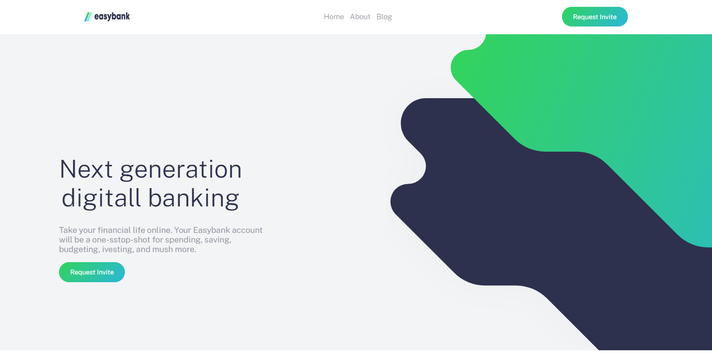

<h3 align="center">Easy Bank</h3>

## Introduction:

Concept of a bank web page EASYBANK

## Start:

```sh
$ git clone https://github.com/brunofariasdev/easybank.git
```

```sh
$ cd easybank
```

```sh
$ yarn install
```

```
$ yarn start
```

## Screens:
	Desktop
<p align="center">
	
  </a>
</p>

---


## Credits
<a href="https://www.instagram.com/brunofarias_dev/">@Brunofarias</a>
